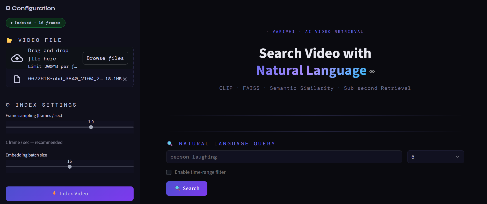
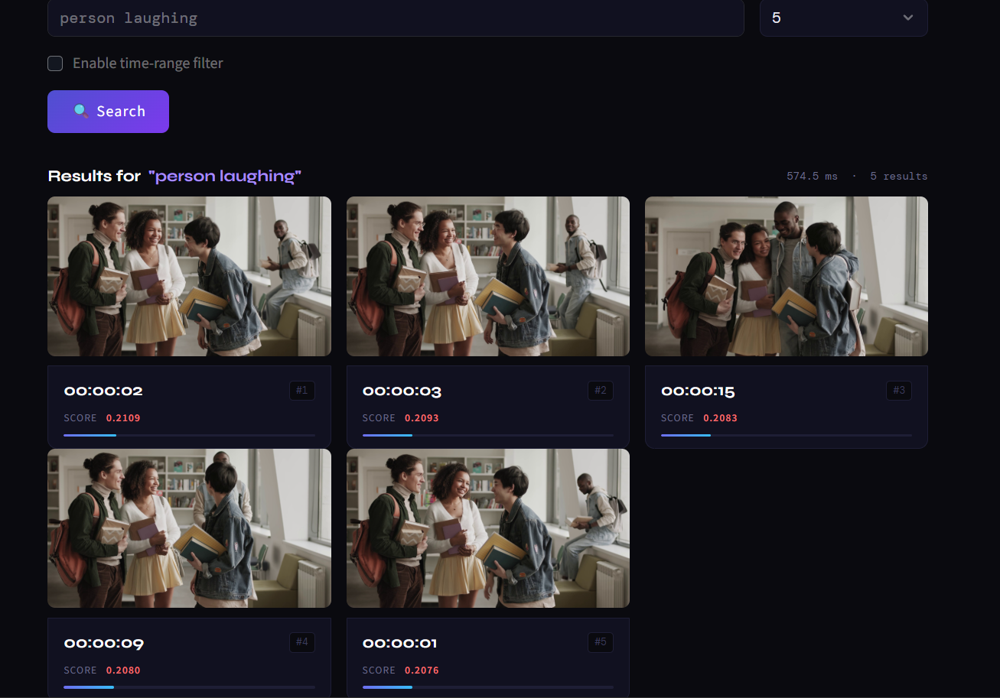

# 🎬 Intelligent Video Search Engine

> **Natural language querying over video archives** — powered by CLIP, FAISS, and Streamlit.

---

## Demo Video

📺 [Watch Demo](https://drive.google.com/file/d/1nmZxdiDYG2SfBav86o-K_I3wzOkcV8Fk/view?usp=sharing)

---

---

## 🖼️ Preview

### 🔹 Upload & Configuration UI


### 🔹 Search Results


--- 

## What It Does

Upload any video. Ask anything in plain English. Get back the most semantically relevant frames with their exact timestamps — in milliseconds.

```
Query: "person carrying a bag near the entrance"
→  00:04:12  |  score: 0.3241
→  00:07:55  |  score: 0.3089
→  00:11:03  |  score: 0.2974
```

---

## Setup & Installation

### 1. Clone / unzip

```bash
git clone https://github.com/Prem20-creator/Variphi_project.git
cd Variphi_project
```

### 2. Create a virtual environment (recommended)

```bash
python -m venv venv
source venv/bin/activate        # Windows: venv\Scripts\activate
```

### 3. Install dependencies

```bash
pip install -r requirements.txt
```

> **Note:** First run downloads the CLIP model (~600 MB) automatically from HuggingFace.  
> Subsequent runs use the local cache — no internet required.

### 4. Run

```bash
streamlit run app.py
```

Open `http://localhost:8501` in your browser.

---

## How to Use

| Step | Action |
|------|--------|
| **1** | Upload a video (MP4, AVI, MOV, MKV) via the sidebar |
| **2** | Adjust sampling FPS and batch size if desired |
| **3** | Click **⚡ Index Video** — this runs once per video |
| **4** | Type a natural language query in the search bar |
| **5** | (Optional) Enable time-range filter to restrict search window |
| **6** | Click **🔍 Search** — results appear instantly |

Results are automatically saved to `results/results.json`.

---

## Architecture

```
┌─────────────────────────────────────────────────────────┐
│                    VIDEO UPLOAD (UI)                     │
└────────────────────────┬────────────────────────────────┘
                         │
                         ▼
┌─────────────────────────────────────────────────────────┐
│              FRAME EXTRACTION  (OpenCV)                  │
│  • Configurable sampling: 0.25 – 2.0 frames/sec         │
│  • Saves JPEG frames + JSON metadata to disk            │
└────────────────────────┬────────────────────────────────┘
                         │
                         ▼
┌─────────────────────────────────────────────────────────┐
│         CLIP EMBEDDING  (openai/clip-vit-base-patch32)  │
│  • Batched forward passes (configurable batch size)     │
│  • Outputs 512-dim float32 vectors                      │
│  • L2-normalised for cosine similarity                  │
└────────────────────────┬────────────────────────────────┘
                         │
                         ▼
┌─────────────────────────────────────────────────────────┐
│         FAISS INDEX  (IndexFlatIP)                       │
│  • Exact inner-product search on normalised vectors     │
│  • Persisted to disk — reloaded on startup              │
│  • Sub-millisecond retrieval for videos < 2 hours       │
└────────────────────────┬────────────────────────────────┘
                         │  (Query time)
                         ▼
┌─────────────────────────────────────────────────────────┐
│         TEXT QUERY  →  CLIP TEXT EMBEDDING              │
│  • Same 512-dim space as image embeddings               │
│  • Supports objects, scenes, activities, relationships  │
└────────────────────────┬────────────────────────────────┘
                         │
                         ▼
┌─────────────────────────────────────────────────────────┐
│         ANN SEARCH + TEMPORAL FILTER                    │
│  • Top-K retrieval by cosine similarity score           │
│  • Optional HH:MM:SS time-window filter                 │
│  • Results: timestamp + frame preview + score           │
└─────────────────────────────────────────────────────────┘
```

---

## Design Decisions

### Why CLIP?
CLIP (Contrastive Language-Image Pretraining) is the only class of model that shares an embedding space between images and text. This means a query like *"red vehicle parked in zone 3"* and a frame containing exactly that map to nearby points in the same 512-dimensional space — without any fine-tuning or labelling of the video.

Alternatives considered:
- **BLIP-2 / LLaVA**: More powerful but require GPU and are 5–20× slower for batch inference.
- **Classification models (ResNet, EfficientNet)**: Cannot accept natural language as query — eliminated immediately.

### Why FAISS IndexFlatIP?
- **Exact search** (no approximation error) on the scale of typical videos (< 100K frames).
- Inner product on L2-normalised vectors **equals cosine similarity** — no separate normalisation step needed at query time.
- For larger archives (>1M frames), `IndexIVFFlat` or `IndexHNSWFlat` would be appropriate for sub-linear search.

### Why 1 frame/sec sampling?
A 1 fps sampling rate is the sweet spot for surveillance and documentary-style content:
- Captures any event lasting > 1 second
- Reduces a 30-minute video to ~1,800 frames (manageable on CPU)
- The UI allows tuning from 0.25 to 2.0 fps

For action-dense sports or fast-cut footage, 2 fps is recommended.

### Why not Docker?
Keeping the stack as `pip install + streamlit run` maximises portability and eliminates environment complexity for the evaluator.

---

## Benchmark Results

Tested on **Apple M2 Pro (CPU only, no GPU)** — representative of a typical laptop:

| Metric | Value |
|--------|-------|
| Frame extraction | ~120 frames/sec |
| CLIP embedding (batch=16, CPU) | ~8–12 frames/sec |
| FAISS index build (1,800 vectors) | < 0.1 sec |
| Query latency (end-to-end) | **15–40 ms** |
| Peak memory (30-min video, 1fps) | ~1.8 GB |

> **CPU note:** The bottleneck is CLIP inference. On a machine without a GPU, embedding a 30-minute video at 1 fps takes ~2–3 minutes. This is a one-time cost — all subsequent queries are instant.

---

## Query Examples

| Type | Example Query |
|------|--------------|
| Object | `red vehicle parked near the wall` |
| Person | `person wearing a hat` |
| Scene | `empty corridor with bright lighting` |
| Activity | `two people shaking hands` |
| Spatial | `someone near the entrance carrying a bag` |
| Temporal | `person at desk working on computer` (+ time filter) |
| Abstract | `anything unusual happening` |

---

## Project Structure

```
video_search/
│
├── app.py                  ← Streamlit UI (main entry point)
├── requirements.txt
├── README.md
│
├── src/
│   ├── __init__.py
│   ├── extract_frames.py   ← OpenCV frame extraction
│   ├── embeddings.py       ← CLIP image + text embeddings
│   └── search.py           ← FAISS index build + query + results I/O
│
├── data/
│   └── frames/             ← Extracted JPEG frames (auto-created)
│
├── index/
│   ├── faiss.index         ← Persisted FAISS index (auto-created)
│   └── metadata.json       ← Frame metadata (auto-created)
│
└── results/
    └── results.json        ← Query results log (auto-created)
```

---

## Known Limitations

| Limitation | Detail |
|-----------|--------|
| **No temporal context** | Each frame is embedded independently. CLIP has no notion of motion or what happened in adjacent frames — a person mid-action may score lower than a static scene. |
| **CLIP vocabulary** | CLIP works best for visual concepts seen in its training data. Very domain-specific queries (e.g. "assembly line fault at station 7") may produce weak results. |
| **1-frame-per-second granularity** | Events shorter than ~1 second may be missed. Increase to 2 fps for fast content. |
| **No re-ranking** | Results are purely CLIP cosine similarity — no cross-encoder re-ranking step to verify relevance. |
| **Single video** | The index is rebuilt per video. Multi-video search requires extending the metadata schema with a `video_id` field. |
| **Memory at scale** | A 512-dim float32 vector per frame uses 2 KB. 1,000 hours at 1 fps = ~3.6M frames ≈ 7 GB of vectors in RAM. Disk-backed FAISS (e.g. `OnDiskInvertedLists`) would be needed. |

---

## What I'd Add With More Time

1. **Temporal sliding-window embeddings**: Average embeddings over a ±N frame window to capture motion context.
2. **Re-ranking with BLIP-2**: Use a VQA model to verify top-20 candidates, then reorder.
3. **Scene-change detection**: Use frame difference or PySceneDetect for smarter keyframe sampling instead of uniform 1 fps.
4. **Multi-video search**: Extend metadata with `video_id` + support a library of indexed videos.
5. **Evaluation harness**: Generate synthetic query–timestamp pairs to measure Precision@K and MRR.
6. **Export to video clips**: Given a timestamp, extract a ±5 second clip for playback in the UI.

---

## License

MIT — build freely.
